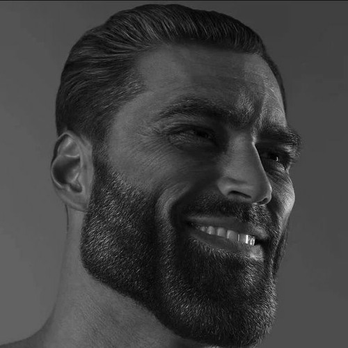

# Introduction
Hi! I'm Nurmohamad Aiman, a student in the Software Maintenance and Evolution course. 

As a small time indie game developer, I expected to know on how to maintain and improve softwares over time as these two aspects are crucial in game development.

Also, to gain hands-on experience with version control and GitHub collaboration and learn about modern software maintenance practices for the sake of my future job.

  <!-- Link to the uploaded image -->

## GitHub Profile

You can view my personalized GitHub profile [here] (https://github.com/Aiman-Alias)

